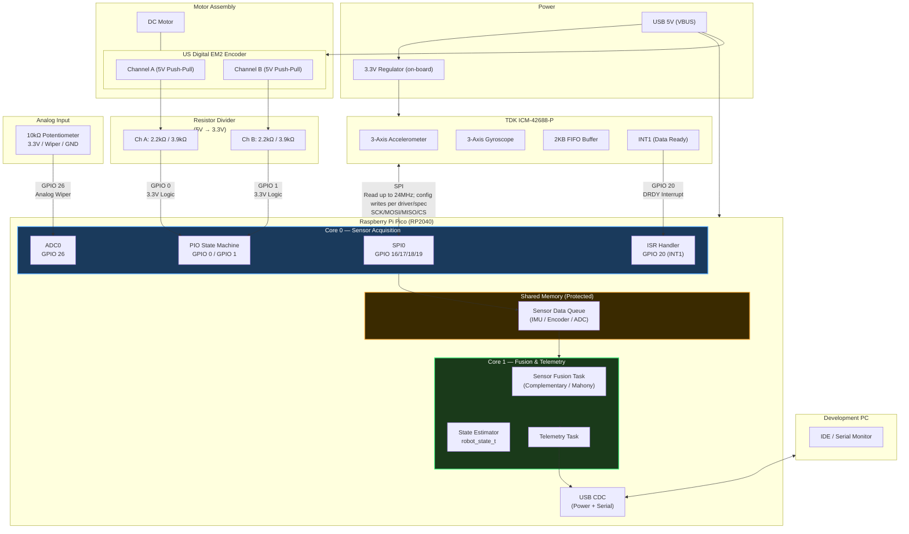

## Motor Assembly
Leveraging a single motor and encoder from a disassembled [Arlobot robot](https://github.com/tslator/arlobot_freesoc).  The quadrature encoder (US Digital EM2) reads a 2000 count/rev disk with index.  The encoder is a 5v device and requires resister divider to interface with the Pico.

NOTE: An appropriate PWM signal is required to drive the motor electrically, but the motor shaft can be turned manually to trigger encoder counts.

## Power
Using a bread board power supply that provides 3.3v and 5v rails.

## Analog Input
A simple 10kΩ potentiometer is used to trigger the ADC.

## IMU Input
The ICM-42688 is connected to the SPI bus and interrupt.

### INT1 vs INT2 — Interrupt Pin Selection

The ICM-42688-P exposes two configurable interrupt output pins. The choice affects
ISR complexity and Core 0 workload.

| Attribute | INT1 | INT2 |
|---|---|---|
| **Configurable functions** | Data Ready, FIFO Watermark, FIFO Full, UI-AGC, Reset Done, PLL Ready | Data Ready, FIFO Watermark, FIFO Full only |
| **Default state** | Active after reset | Inactive after reset |
| **Output mode** | Push-pull or open-drain (configurable) | Push-pull or open-drain (configurable) |
| **Best use** | General-purpose: route whichever interrupt mode is chosen | Offload a second trigger (e.g. FIFO Full alert) to free INT1 for primary use |

**Recommended configuration for this project: INT1, FIFO Watermark mode**

Configuring INT1 to fire on a FIFO watermark (e.g., 8 samples) rather than
per-sample Data Ready reduces ISR entry frequency by 8× at 1kHz (125Hz ISR vs
1kHz ISR) while the FIFO buffers samples between bursts. The ISR drains the FIFO
in a single SPI burst read, reducing bus overhead and Core 0 interrupt load.

If a second interrupt is needed in future (e.g., hardware "FIFO nearly full" as an
overflow guard), INT2 can be enabled independently without reconfiguring INT1.

**INT1 is used for the initial implementation. The interrupt mode (Data Ready vs
FIFO Watermark) is deferred to the driver development phase (Phase 4), where
timing measurements will confirm which approach best meets the 1kHz frame rate.**

## Pico

General processing:
1. Sensor inputs are received
2. Placed into sensor queues stored (shared memory)
3. Retrieved from the sensor queues
4. Processed
5. Transmitted to Serial for Telemetry

### Core 0
#### Motor Encoder
Quadrature signals (Ch A and Ch B) are connected to GPIO 0 and GPIO 1 to take advantage of the PIO state machine for quadrature processing.

#### Analog Input
Potentiometer input is routed to the GPIO 26.

#### IMU Input
SPI bus communication connections are via GPIO 16/17/18/19 while the interrupt output is connected to GPIO 20 (INT1).
For this prototype, high-rate IMU reads may run up to 24MHz while setup/configuration writes follow the driver and datasheet write-limit guidance.

The interrupt mode used on INT1 (Data Ready vs. FIFO Watermark) is intentionally
deferred to Phase 4 driver development, where timing measurements will confirm the
best approach. See the INT1 vs INT2 section below and HW-DESIGN-NOTE-001 for
rationale. The diagram labels INT1 as "DRDY Interrupt" as a placeholder reflecting
the default power-on register state; this will be updated once the driver decision
is made.

### Shared Memory
Protected memory that holds sensor queues.

### Core 1
Retrieves data from sensor queues, processes, and transmits the data for monitoring.

## Hardware Diagram

