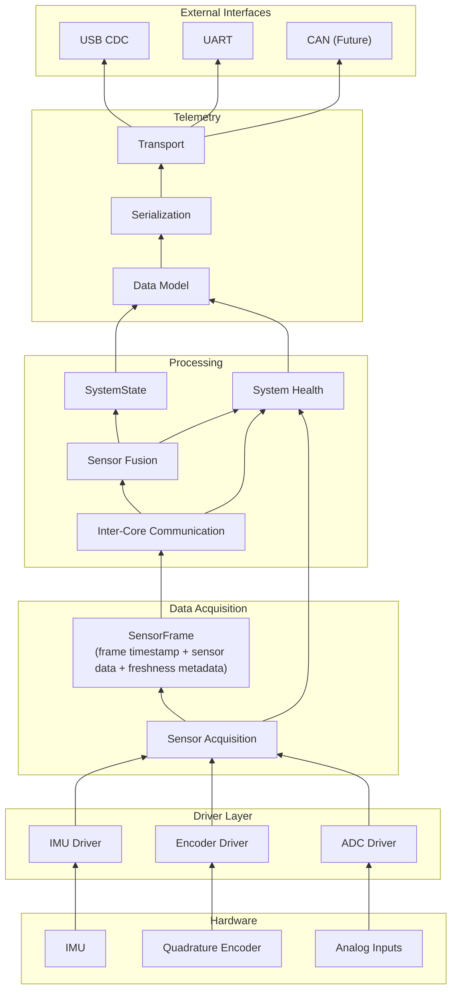
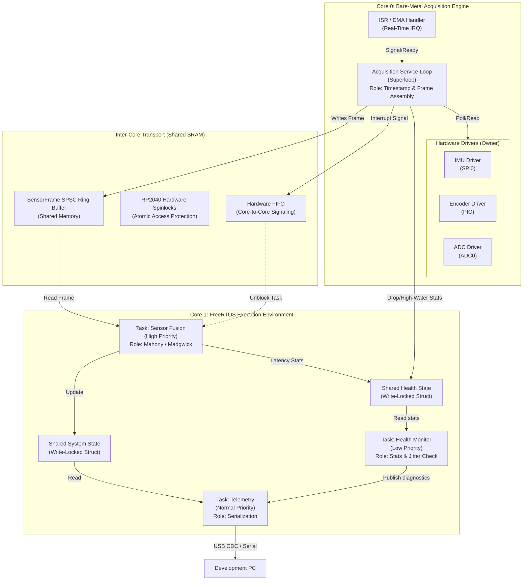

## Purpose
Describe the software architecture in terms of layers, including the major software components, responsibilities, and data flow.

## Architecture
- The application never talks directly to USB, UART, or CAN.  It produces `SystemState` and `HealthState`, which are passed to the telemetry subsystem.
- The telemetry subsystem is explicitly layered into:
  - Data Model
  - Serialization
  - Transport
  **Reinforces the design goal that changing from USB to UART should only affect the transport layer**
- `SensorFrame`, `SystemState`, and `HealthState` become the key data structures in the system:
    - `SensorFrame` : frame-referenced sensor inputs with per-sensor freshness metadata
    - `SystemState` : processed outputs
    - `HealthState` : queue and timing metrics for runtime observability
- Inter-core communication is represented as a software component rather than exposing implementation details like queues or shared memory.

## RTOS Task Partitioning

The principal partitioning occurs at the process core level. Core 0 runs a bare-metal acquisition superloop and is responsible for interfacing with hardware and acquiring data from the sensors. Core 1 runs FreeRTOS and is responsible for processing sensor data, health monitoring, and telemetry.

Health monitoring follows a separate `HealthState` path rather than being embedded in `SystemState`. `TASK_HEALTH` aggregates queue depth and sample-rate metrics from acquisition and IPC boundaries, plus processing-latency metrics from fusion timing signals, then publishes these diagnostics through a dedicated mutex-protected structure consumed by telemetry. This keeps ownership clear: `SystemState` represents fused motion outputs, while `HealthState` represents runtime observability and pipeline health.

**Key Design Decisions**

|Component|Architecture Role|
|---|---|
|Strict Ownership|Core 0 exclusively owns all hardware peripherals.  If Core 1 wants sensor data, it must wait for the Queue.|
|Coherent Frames|Core 0 produces a `SensorFrame` with one frame timestamp and per-sensor freshness flags so Fusion can distinguish new, carried-forward, and stale values across asynchronous IMU, Encoder, and ADC updates.|
|Isolation|The "Sensor Fusion" software is abstracted from the hardware, facilitating testing.|
|Telemetry Decoupling|Telemetry runs at its own rate, e.g. 10Hz, by reading the last known state through a Mutex, preventing slow serial prints from interfering with the 100Hz Fusion loop.|

## Architecture Diagram

## RTOS Task Diagram

